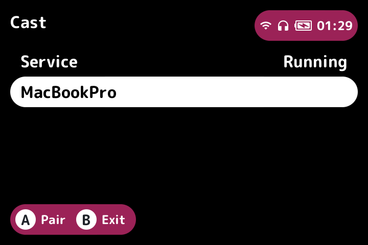
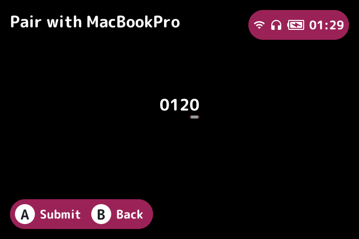

# rgsp-cast

<p>


</p>

Stream the screen and sound of an **Anbernic RG SP** (Allwinner H700 /
sun50iw9, **BaseOS + NextUI**) to any Moonlight client — an Apple TV, a phone,
a desktop — and play it from there.

The handheld runs a GameStream host. It reads `/dev/fb0`, encodes on the SoC's
Cedar video engine, and captures game audio through a kernel ALSA loopback.
Video encoding is entirely in hardware, including the RGB→YUV conversion and
the scale to whatever resolution the client negotiates, so capture costs about
**one seventh of one CPU core** and the emulator does not notice it is running.

```
720x480 panel · H.264 Main · hardware-scaled to the client's resolution
48 kHz stereo Opus · ~17 ms host-side latency (one frame)
```

| | |
|---|---|
| Device | Anbernic RG SP, Allwinner H700 (H616/H618 family, `sun50iw9`) |
| OS | BaseOS + NextUI, kernel 4.9.170 |
| Panel | 720x480, 32bpp BGRA, double-buffered (720x960 virtual) |
| IC version | `0x3301000012011` |
| Video | H.264 Main, level 4.1, hardware-scaled to the negotiated resolution |
| Audio | Opus 48 kHz stereo, 5 ms frames, via `snd-aloop` |
| Input | client → handheld, injected through `/dev/uinput` |
| Protocol | GameStream, on a vendored [moonshine](https://github.com/hgaiser/moonshine) |
| Clients | Moonlight (tvOS, macOS, iOS, Android, desktop) |

A standalone capture tool (`rgsp-cast`, built from `rgsp-cedar/src/bin/rgsp-cast.rs`,
records to a file) also exists, and is how the encoder is exercised without a
client.

---

## Quick start

```sh
# 1. Fetch the vendor libraries (once). Downloads the pinned TrimUI firmware,
#    verifies its checksum, and extracts the CedarC libs into vendor-libs/.
./scripts/extract-vendor-libs.sh

# 2. Build the loopback module (once). The stock kernel ships without it.
./scripts/build-snd-aloop.sh

# 3. Build and install the pak, the hooks and the vendor libs.
make pak
./scripts/install-pak.sh root@DEVICE
```

Then on the handheld: **Tools → Cast**. It toggles — once to start, again to
stop — and shows whether the service is running.

To pair, add the handheld's IP in Moonlight. The client shows up by itself in
the Cast list, labelled by hostname where the network resolves one, otherwise
by IP. Select it and type the 4-digit PIN Moonlight is showing, using the
D-pad: left/right moves between digits, up/down changes the selected one, A
submits, B goes back. Pairing persists.

Recording to a file instead, no client involved:

```sh
make run DEVICE=root@DEVICE DURATION=30 OUT=session.h264
# -> session.mp4: video stream-copied, audio encoded to AAC
```

Already have the firmware? Pass it instead of downloading — `.zip` or `.awimg`:

```sh
./scripts/extract-vendor-libs.sh ~/Downloads/trimui_tg5040_20251128_v1.1.1.zip
```

---

## Streaming

The host advertises **H.264 only**, and every client setting works with it,
including "auto" codec selection.

What the client negotiates, it gets:

- **Resolution.** The panel is 720x480; the VE scales to whatever the client
  asked for. The image is pillarboxed to keep its proportions, so a 16:9 client
  sees black bars rather than a stretched picture.
- **Bitrate.** Capped at 6 Mbps regardless of the request — the source is a
  720x480 panel, and a higher ceiling only produces keyframes large enough to
  strain the handheld's Wi-Fi.
- **Keyframes** are client-driven. The encoder's periodic interval is pushed
  out, and an IDR is produced when the client asks for one, at most one per
  750 ms.

One session at a time. While casting, all handheld audio is routed to the
client and its own speaker is silent; both are restored when casting stops.

### Input

The client can drive the handheld. Input arrives on the control stream and is
injected through `/dev/uinput` as a second gamepad advertising exactly the codes
the handheld's own `ANBERNIC-keys` reports, so anything that maps the real pad
by key code treats this one identically.

A connected controller works directly. Without one, the keyboard is mapped:

| key | button |
|---|---|
| arrows | d-pad |
| Z / X | A / B |
| A / S | X / Y |
| Q / W | L1 / R1 |
| Enter / Backspace | Start / Select |
| Escape | menu |

Two mappings the hardware forces: it exposes `BTN_TL2` but no `BTN_TR2`, so the
right trigger drives `ABS_RZ`; and there is no `BTN_MODE`, so Guide maps to
`KEY_GOTO`. Everything held is released when the session ends, so a client that
disconnects mid-press cannot leave a button stuck down.

---

## How it works

```
/dev/fb0 ─pread─> heap buf ─memcpy─> ION buffer ─> Cedar VE ─> H.264 ─> packetize ─> UDP
  BGRA            (cached)           (IOMMU)       ISP: RGB→YUV        RTP+FEC+AES
  720x480                            pillarboxed   + scale to client

snd-aloop ─readi─> PCM ─> bridge ─> Opus ─────────────────────────────> UDP
  capture side           (i16→f32)   5 ms frames                        RTP+FEC

client ─────────> control stream ─> decode ─> /dev/uinput ─> the emulator
  buttons, keys                      state              a second gamepad
```

Per frame: read the visible framebuffer page, copy it into the encoder's ION
input buffer, submit, drain the bitstream. The VE's ISP block does the colour
conversion on ingest, so the CPU never touches pixel values.

Cedar capture lives in `rgsp-cedar`, a standalone crate over the vendor VE
libraries; `rgsp-host` consumes it. `rgsp-host` owns capture, encoding, input
injection and audio routing; the vendored moonshine crate owns pairing, RTSP,
packetization, encryption and the sockets. The two meet at `host_source.rs` on
the video and audio sides and `host_input.rs` on the control side — all
host-specific logic lives in those files so the vendored tree stays
mergeable.

Double buffering matters: the panel has a 720x960 virtual framebuffer and
`yoffset` says which half is on screen. Reading offset 0 unconditionally — as
the reference implementation does — can capture the buffer being drawn into
rather than the one being displayed.

### Layout

```
rgsp-host/                       the streaming daemon
  src/capture.rs                 re-export of rgsp-cedar
  src/video.rs  src/audio.rs     capture loops, pacing, ALSA loopback
  src/input.rs  src/input_decode.rs   virtual gamepad, packet decoding
  src/routing.rs                 .asoundrc swap while casting
rgsp-cedar/                      the Cedar VE capture library (Rust)
  src/capture.rs                 open/next/Drop over the vendor ABI
  src/vendor_abi.rs              vencoder.h struct layouts and constants
  src/vendor_lib.rs              dlopen'd vendor library, symbol lookup
  src/bitstream.rs                Annex-B / AVCC bitstream handling
  src/geometry.rs                 scale and pillarbox math
  src/framebuffer.rs             /dev/fb0 read, double-buffer handling
  src/convert.rs                  pixel format conversion helpers
  src/bin/rgsp-cast.rs            standalone capture tool over the crate
  tests/fixtures/                 recorded bitstream fixtures
vendor/moonshine/                GameStream protocol layer (git subtree)
  .../video/host_source.rs       our video seam: packetize loop, encoder control
  .../audio/host_source.rs       our audio seam: PCM -> Opus frame bridge
  .../control/host_input.rs      our input seam: forward client input
pak/                             NextUI pak: launch.sh (toggle), hooks, icon
scripts/install-pak.sh           install pak + hooks + vendor libs on the device
scripts/extract-vendor-libs.sh   pull CedarC libs from TrimUI firmware
scripts/build-snd-aloop.sh       build snd-aloop.ko for the stock kernel
scripts/reference/               the device's own kernel config, from IKCFG_ST
scripts/monitor.sh               raw CPU/GPU/thermal sampler
bin/snd-aloop.ko                 the built module (vermagic + CRCs match stock)
Makefile                         build / deploy / run / monitor
```

---

## Working on it

### The device

```
ssh root@192.168.180.106        # password: root
```

Everything ships to `/mnt/SDCARD/Tools/h700/Cast.pak/`. The daemon writes
`/tmp/rgsp/daemon.log` and `/tmp/rgsp/daemon.pid`.

The device sleeps and drops off the network. If SSH times out, it is asleep —
wake it rather than assuming a fault.

### Building

Everything cross-compiles in an arm64 container; there is no toolchain on the
device and none on the host.

```sh
make pak                    # the full pak, ready to install
make test-rust              # the Rust suite, in the container
./tests/test_launch_sh.sh   # pak toggle behaviour
./tests/test_hooks.sh       # NextUI hook behaviour
```

**`libopus-dev` must not be installed in the build container.** With it,
`audiopus_sys` links Opus dynamically; the device has no libopus and the binary
dies at startup. Without it, Opus is built from source and linked statically.
The correct package set is `cmake clang libasound2-dev pkg-config`. This choice
is cached in `target/`, so switching requires `cargo clean -p audiopus_sys` —
`make pak` and `make test-rust` both do it.

### Deploying

The daemon runs as `./rgsp-host` with a relative path, so `pkill -f
Cast.pak/rgsp-host` does not match it. Kill it by PID:

```sh
P=$(ssh root@DEVICE 'ps | grep "[r]gsp-host" | awk "{print \$1}"')
ssh root@DEVICE "kill -9 $P"
```

An `scp` over a running binary fails with `dest open ... Failure`, so stop it
first. **Verify what is actually on the device after deploying** — compare
`md5 -q target/release/rgsp-host` against `md5sum` on the device. Testing a
stale binary produces conclusions that are entirely wrong.

Start it through `launch.sh`, never directly: it exports `LD_LIBRARY_PATH` for
the vendor CedarC libs, and without it `dlopen(libVE.so)` fails and capture
never opens. `launch.sh` is a toggle — running it twice stops the daemon.

### Testing against a client

Do not iterate through the TV; it yields one bit of information per attempt.
Use `moonlight-qt` on a desktop, which logs the client's own reasoning:

```sh
/Applications/Moonlight.app/Contents/MacOS/Moonlight pair 192.168.180.106 --pin 1234

/Applications/Moonlight.app/Contents/MacOS/Moonlight stream 192.168.180.106 "RG SP" \
  --720 --fps 60 --bitrate 5000 --display-mode windowed --video-decoder hardware
```

The PIN itself has to go in on the handheld now — **Tools → Cast**, select the
pending client, enter the PIN with the D-pad. There is no headless way to
answer a pairing request; someone has to be at the device.

Its log lands in `/tmp/Moonlight-*.log`. `Waiting for IDR frame`, `Reached
consecutive drop limit` and `Received first audio/video packet` are the lines
that matter.

`--video-decoder hardware` matters: it uses VideoToolbox, like every Apple
client, and is far stricter than the software decoder. A stream can work with
`software` and fail on an Apple TV.

**Kill the client when finished** (`pkill -9 -f Moonlight`, which the `stream`
child alone does not satisfy). The host serves one session and a lingering
client silently holds it, which looks exactly like a broken host to whoever
tries next.

### Diagnostics

```sh
RUST_LOG=rgsp_host=debug,moonshine_core::session::stream=debug
```

- `latency: encode N ms, queue wait N ms` — host-side budget. Encode includes
  the frame-pacing sleep, so ~17 ms at 60 fps is idle, not work.
- `audio: N periods captured, peak amplitude N` — peak 0 means silence is being
  captured; non-zero means the fault is downstream.
- `audio encoder behind: N PCM frame(s) dropped` — audible as crackle.
- `input: N packets, M not applicable to the pad` — mouse/scroll/pen/haptics
  land in M; if N stays 0 the client is sending nothing.

### Things that will mislead you

- **`pgrep -f <pattern>` matches your own SSH command line.** Use `ps | grep
  "[r]gsp-host"`.
- **`find` with escaped parens through SSH** errors into `/dev/null` and looks
  like "no results". Verify a negative result before believing it.
- **BSD `sed -i` needs an explicit backup suffix** (`sed -i ''`). Without one it
  fails and the file is untouched, so a fault injection silently does nothing
  and the test "passes".
- **`.asoundrc` only affects processes that open ALSA afterwards.** A game
  already running when casting starts is not routed.
- **snd-aloop rejects the implicit start** that `readi()` would do; capture
  needs an explicit `prepare()` + `start()`.
- **Input key codes carry a `0x80` high byte.** The down arrow arrives as
  `0x8028`, not `0x0028`; mask with `0x00FF` as Sunshine does
  (`src/input.cpp`). Unmasked, nothing matches and every key is silently
  ignored.
- **Magic `0x0D` is both `MULTI_CONTROLLER` and `ENABLE_HAPTICS`**, separated
  only by length (24 bytes vs 6).
- **moonlight-qt sends keyboard, not controller, packets** unless a gamepad is
  attached, so testing the controller path needs real hardware.

---

## The vendored protocol layer

`vendor/moonshine/` is a `git subtree` of
[hgaiser/moonshine](https://github.com/hgaiser/moonshine) (BSD-2-Clause),
pinned at **v0.15.0**.

```sh
git subtree pull --prefix=vendor/moonshine \
  https://github.com/hgaiser/moonshine.git <tag> --squash
```

Only the protocol layer is used: webserver + pairing, RTSP, TLS, crypto,
clients, discovery, packetizer, gso_socket, shard_batch, control and audio
(~5,234 lines). Keep these files as close to upstream as possible so a pull
merges cleanly: no reformatting, no renaming, no refactors. New logic belongs in
the `host_source.rs` / `host_input.rs` files; where an upstream file is edited,
the reason is in a comment at the edit.

Upstream assumptions that no longer hold here are worth checking before trusting
them: it was written for a Vulkan encoder on a desktop, and this device has
neither the throughput nor the codec support that implies.

### What was deleted

Subsystems the device cannot support:

- `session/compositor/` — Wayland (smithay) + DRM/GBM.
- `session/stream/video/pipeline/` — Vulkan video encode (ash, pixelforge).
- `session/stream/audio/pulse_server/` — embedded PulseAudio server.
- `session/stream/audio/buffer.rs` — mixing buffers on the `pulseaudio` crate's
  protocol types.
- `app_scanner/` — Steam/Heroic/Lutris/desktop scanning.
- `session/stream/control/input/` — input injection via inputtino, feeding the
  compositor. Replaced by this project's `/dev/uinput` path.
- `session/inhibit.rs` — logind sleep inhibitor over zbus.
- `healthcheck.rs` — Vulkan encoder probe via pixelforge.
- `moonshine-wsi/` — Vulkan WSI layer.

Reduced rather than deleted: `session/application.rs` keeps only
`ApplicationConfig`, which the applist/launch endpoints need; the systemd/zbus
launcher is gone.

Vendored workspace scaffolding removed so the repo root owns the workspace:
`Cargo.toml`, `Cargo.lock`, `src/` (the `moonshine` binary), `moonshine-tools/`,
`flake.nix`, `flake.lock`, `nix/`, `nfpm.yaml`, `dist/`.

### Visibility and behaviour changes

`lib.rs`: `crypto` is `pub`. `session/stream/video/mod.rs`: `gso_socket`,
`packetizer` and `shard_batch` are `pub`, with their items promoted from
`pub(crate)`. `moonshine-core/tests/protocol_surface.rs` guards these — it fails
to compile if a subtree pull reverts them.

- Pairing has no desktop notification and no browser PIN page; pending clients
  are listed and answered from the on-device UI instead
  (`rgsp-host/src/control.rs`).
- `/appasset` serves the configured boxart verbatim rather than rescaling it to
  600x801 (which needed the `image` crate).
- `HdrMetadata` / `HdrModeState` moved from the deleted `compositor/frame.rs`
  into `session/stream/video/mod.rs`; `AudioFrame` and `CAPTURE_SAMPLE_RATE`
  moved from the deleted `pulse_server/` into `session/stream/audio/mod.rs`.
- The RTSP DESCRIBE payload no longer advertises HEVC or AV1. Clients decide
  codec support by string-matching `sprop-parameter-sets=AAAAAU` and
  `AV1/90000` there, not from `ServerCodecModeSupport`, and this host encodes
  H.264 only.

---

## Vendor libraries

CedarC is Allwinner's closed-source userspace runtime for Cedar, the video
engine baked into the SoC. The kernel driver (`/dev/cedar_dev`) only hands out
register access and interrupts; everything that makes the block usable —
programming the encoder, the ISP colour conversion and scaler, rate control,
the ION/IOMMU buffer plumbing — lives in these `.so` files. There is no
V4L2 M2M driver on this 4.9 kernel and no open replacement that supports this
silicon, so the host `dlopen`s `libvencoder.so` and calls the vendor ABI
directly. Without them there is no hardware encoding, and software H.264 on
four Cortex-A53s cannot hold 720x480 at frame rate while an emulator runs.

They are proprietary, they cannot be redistributed here, and — the awkward part
— they do not ship on the device this project targets:

**Anbernic's own firmware ships no CedarC runtime at all.** Mounting the stock
image shows `libVE.so`, `libMemAdapter.so`, `libcdc_base.so` and
`libvdecoder.so` are absent; the only trace is a dangling `DT_NEEDED` reference
from an unused vendor demo at `/bin/video/xplayerdemo2`.

So the libraries come from another device in the same VE family. **TrimUI Smart
Pro firmware v1.1.1** (H618) carries a current, glibc-2.33 build that loads on
BaseOS unmodified:

```
libvencoder.so  libvenc_base.so  libvenc_common.so
libvenc_h264.so libvenc_h265.so  libvenc_jpeg.so
libVE.so        libMemAdapter.so libcdc_base.so   libvideoengine.so
```

Download from **[trimui/firmware_smartpro releases](https://github.com/trimui/firmware_smartpro/releases)**,
release **v1.1.1** (2025-12-01). That release has two assets and only one is
usable:

| asset | size | |
|---|---|---|
| `trimui_tg5040_20251128_v1.1.1.zip` | 240 MB | ✅ unzip → `trimui_tg5040.awimg` (IMAGEWTY, contains the ext4 rootfs) |
| `sd_recovery_tg5040_smart_pro_v1.1.1_*.zip` | 2.0 GB | ❌ PhoenixCard burn image — bogus partition table, payload not mountable |

`scripts/extract-vendor-libs.sh` pulls the libraries out of the `.awimg`. These
are proprietary binaries and are deliberately not committed here.

The script hardcodes `ROOTFS_OFFSET=18095104` (`0x1141c00`), read from this
build's IMAGEWTY file table. A future firmware will move it; override with
`ROOTFS_OFFSET=<n> ./scripts/extract-vendor-libs.sh ...` after re-deriving it.

**Version matters.** Older CedarC builds refuse this silicon outright:

```
error: the driver do not support the ic 12011
```

That is a whitelist inside `libvenc_codec.so`, not a hardware limit. The blob
that fails self-identifies as `CedarC-v1.2.0, commit 15195bd, 2019-05-07` —
predating the H616/H618 entirely. The 2025 TrimUI build accepts it.

### Vendor ABI notes

Hard-won, and none of it documented upstream.

**`VENC_IndexParamH264SPSPPS` is `0x101`, not 16.** The H.264 parameters live in
their own block starting at `0x100` (`vencoder.h:765`), so the parameter-set
index is `0x100 + 1`. Querying index `16` returns an unrelated parameter whose
value looks superficially plausible — a pointer plus a frame-sized length —
which is how the reference implementation concluded SPS/PPS "lives in VE SRAM,
not CPU-accessible" and resorted to hardcoding parameter sets per resolution. At
`0x101` the real sets come back in ordinary CPU memory.

**Parameter sets arrive as `avcC`, frames as AVCC.**
`VideoEncGetParameter(0x101)` returns an AVCDecoderConfigurationRecord:

```
01 64 00 33 ff | 01 00 0a | 67 4d 00 29 96 54 05 a1 e8 80 | 01 00 04 | 68 ee 3c 80
^version       ^1 SPS,10B  ^SPS                            ^1 PPS,4B  ^PPS
```

and frame data is length-prefixed AVCC (`00 00 23 b9 65 88 …`). Both need
converting to Annex-B start codes or nothing decodes. They must also be fetched
**after** the first frame is encoded; before that the call returns a pointer
with `nLength = 0`.

**Parameter sets must precede every keyframe.** The VE emits them only on the
first frame; a client-requested IDR arrives bare. Software decoders reuse the
sets they cached and never notice, but VideoToolbox builds its format
description from the sets carried with the keyframe and will never start.

**The encoder is Main profile with CABAC.** Not baseline. A hand-generated
baseline SPS decodes as garbage (`cabac_init_idc overflow`, `QP out of range`)
because the slice headers do not match. Use the parameter sets the encoder gives
you.

**Format names are 32-bit word order, not byte order.** For a framebuffer whose
bytes are B,G,R,A the correct constant is **`VENC_PIXEL_ARGB` (12)** — *not*
`VENC_PIXEL_BGRA` (15), which produces a blue-cast image. Determined by sweeping
all four: 15 blue-cast, 13 red-cast, 14 close but wrong, 12 correct. Verified at
**42.2 dB PSNR** against the CPU conversion path (a channel swap scores ~10 dB).

**Vendor structs are written past their documented fields.** Every struct passed
to the library needs trailing padding. A bare 16-byte `VencHeaderData` on the
stack is what produced `*** stack smashing detected ***` in the reference tool.

**Capability queries do not work.** `VENC_IndexParamMAXSupportSize` (22) and
`VENC_IndexParamCheckColorFormat` (23) both return `h264 do not support this
indexType` on this build, so supported formats have to be probed by trying them.

**The default key-frame interval is 25 frames.** At 60 fps that is a large burst
every 0.4 s. `VENC_IndexParamMaxKeyInterval` (2) pushes it out so IDRs are
client-driven.

---

## Audio

Capture is an ordinary ALSA capture device: `default` feeds the kernel loopback,
and the host reads the other end.

```
game → default → snd-aloop → rgsp-host reads the capture side → Opus → client
```

While casting, `$USERDATA_PATH/.asoundrc` points `pcm.!default` at
`hw:Loopback,0,0`, so everything the handheld plays goes to the client instead
of its speaker. It is removed when casting stops, and a boot hook removes a
stale one left by a crash. Only processes that open ALSA *after* the file is
written are routed, so a game already running when casting starts keeps playing
to the speaker.

The kernel paces the loopback, so the timeline is continuous at 48 kHz and does
not depend on the codec's crystal. Stream parameters are **S16_LE, 2 ch,
48000 Hz**, read in 5 ms periods with a 16-period buffer. A shallower buffer
overruns on this CPU, and each overrun costs a stream reset — sustained, that is
not glitchy audio but no audio.

Opus runs at complexity 5, not libopus's default of 10: the same cores are
encoding video, and at 10 the encoder falls behind and frames are dropped, heard
as constant crackle.

### The loopback module

The stock kernel ships with `CONFIG_SND_ALOOP` unset, so the module is built
separately. `bin/snd-aloop.ko` matches the stock kernel exactly:

```sh
./scripts/build-snd-aloop.sh                 # -> bin/snd-aloop.ko
scp bin/snd-aloop.ko root@DEVICE:/tmp/
ssh root@DEVICE 'insmod /tmp/snd-aloop.ko && cat /proc/asound/cards'
```

It loads **without** `--force`:

```
insmod /tmp/snd-aloop.ko  ->  LOADED OK
 3 [Loopback       ]: Loopback - Loopback
```

Three checks predicted that, and are worth re-running against any future kernel:

| | built | stock |
|---|---|---|
| vermagic | `4.9.170 SMP preempt mod_unload modversions aarch64` | identical |
| `module_layout` CRC | `0x3491861c` | `0x3491861c` |
| shared symbol CRCs | 33 compared against stock modules | 0 mismatches |

The stock values come from the device itself. The kernel is built with
`CONFIG_IKCONFIG_PROC=y`, so it embeds its own gzipped config between `IKCFG_ST`
and `IKCFG_ED` markers in the disk image; that is saved as
`scripts/reference/stock-kernel-4.9.170.config`, 4,209 lines of ground truth.

Requirements the build has to satisfy, all encoded in the script:

- Build against the **`orange-pi-4.9-sun50iw9` BSP tree**. It is the tree whose
  `module_layout` matches; Allwinner patched the core headers relative to
  mainline.
- **Clone inside Linux.** The kernel tree contains filenames differing only by
  case (`ipt_ECN.h` vs `ipt_ecn.h`), which macOS's case-insensitive filesystem
  cannot hold.
- **`CONFIG_MOTORCOMM_PHY=y`.** OrangePi's BSP calls `yt8511_config_out_125m()`
  unconditionally from `phy_device.c`. It must be built in, not a module — the
  caller is built in.
- **Empty `.scmversion`.** `scripts/setlocalversion` otherwise appends `+` for
  an untagged git tree, giving `4.9.170+` and failing the exact vermagic match.

Also from that config: `CONFIG_MODULE_FORCE_LOAD=y` with no `CONFIG_MODULE_SIG`,
so module loading is not gated; and `CONFIG_SND_HRTIMER=y` with
`CONFIG_HIGH_RES_TIMERS=y`, the pacing infrastructure the loopback uses.

### Reading the capture side

**Start the capture stream explicitly.** `snd_pcm_readi()` on a loopback capture
device fails with `-EIO` if it has to start the stream implicitly; call
`snd_pcm_prepare()` and `snd_pcm_start()` first and it works.
`rgsp-host/src/audio.rs` is the reference implementation; note the device ships
no `arecord`, so there is nothing to compare against on the box itself.

Capture parameters must match what the playback side negotiated — snd-aloop
fails the capture side with `-EIO` when the two ends of a cable disagree on
format, rate or channels (`aloop.c`, `loopback_check_format`). The emulator
plays **S16_LE, 2 ch, 48000 Hz**, period 512, buffer 1024.

With no playback open, capture yields silence rather than an error, so a
recorder can be started before the game.

### Routing

NextUI switches audio routing at the ALSA config layer.
`/usr/share/alsa/alsa.conf` loads config in this order:

```
"/etc/asound.conf|||/usr/etc/asound.conf"
"~/.asoundrc"                                 <- routing lives here
```

Paks set `HOME=$USERDATA_PATH`, and the last definition of `pcm.!default` wins,
so `$USERDATA_PATH/.asoundrc` is where the sink is chosen. `audiomon.elf`
(`workspace/all/audiomon/audiomon.cpp`) writes it on BlueZ D-Bus connect and on
udev USB-audio events; `msettings.c:1003` `setHDMIAudioRoute()` handles HDMI
hotplug. Selecting the loopback while casting, and restoring afterwards, is the
same mechanism those already use.

`GetAudioSink()` in libmsettings reports which route is live
(`AUDIO_SINK_DEFAULT` / `_BLUETOOTH` / `_USBDAC`).

Bluetooth playback lags 100–200 ms behind, so it must never be the reference
when calibrating A/V sync.

### Sync

Audio is drained once per video frame. Measured end-to-end difference between
audio and video durations, across runs: **+2, +5, -6 ms**. It does not grow with
duration (same magnitude at 10 s and 30 s), so the video loop's
`CLOCK_MONOTONIC` pacing and the 48 kHz audio clock are locked — a 0.05%
mismatch would show 15 ms of drift over 30 s. Residual uncertainty is a constant
offset bounded by roughly one ALSA period.

Caveats:

- ALSA config is read when a client **opens** the PCM, so a change takes effect
  on the next game launch.
- Muxing needs explicit `-map 0:v -map 1:a`; ffmpeg's automatic stream selection
  silently drops the raw PCM input.
- A paused emulator still writes zeros to the PCM, so a recording made while
  paused contains digital silence (-91 dB), not an error.

---

## Performance

Measured on-device, 30 s capture of live gameplay (GBA via `minarch.elf`), with
a 10 s no-capture baseline for comparison. Raw counters sampled at 4 Hz by
`scripts/monitor.sh`; all arithmetic done off-device so sampling does not distort
the measurement.

| | baseline | during capture | delta |
|---|---|---|---|
| Total CPU | 23.8% (0.95 of 4 cores) | 27.2% (1.09 cores) | **+3.4 pp = +0.14 cores** |
| `rgsp-cast` | — | **14.2%** of one core (max 16.7%) | |
| `minarch.elf` (emulator) | 74.8% of one core | 75.9% | +1.1 pp — noise |
| CPU freq (mean) | 1142 MHz | 1290 MHz | +13% |
| GPU freq | 648 MHz pinned | 648 MHz pinned | unchanged |
| GPU power model | 47.0 mW | 51.4 mW | +9% |
| VE temp (max) | 59.5 °C | 61.1 °C | +1.6 °C |
| CPU temp (max) | 61.7 °C | 63.6 °C | +1.9 °C |

Per frame: **1.8 ms copy + 1.6 ms encode**. 900/900 frames at exactly 30.0 fps,
zero drops, ~2.1 Mbps on gameplay (≈450–510 kbps on static menus).

The emulator is unaffected — 74.8% → 75.9% of a core is within sample noise.
The +3.4 pp of system CPU is almost exactly `rgsp-cast`'s own 14.2% of one core
(14.2/4 = 3.6 pp), so the accounting closes with nothing hidden elsewhere.

The **GPU is not involved**: encoding runs on the VE, a separate block. GPU
frequency is useless as a load signal here — devfreq pins it at 648 MHz in all
conditions.

### Optimisations measured and rejected

Do not retry these without new information.

| attempt | result |
|---|---|
| **NEON colour conversion** | Unnecessary. The VE's ISP converts RGB→YUV on ingest, so the conversion stage is deleted rather than optimised: **18.28 ms → 1.55 ms** CPU per frame, an 11.8x reduction. Hand-written NEON would have optimised a stage that no longer exists. |
| **Zero-copy from framebuffer** | **Corrupt bitstream.** Prerequisites all exist — `smem_start=0xff800000`, `ve_addr_offset=0x0` — and it ran at 0.00 ms CPU, but output fails at `MB 25 0` with every frame a keyframe. The VE reaches memory through an IOMMU (`IOCTL_GET_IOMMU_ADDR`, `cedarv_iommu_buff`) that only maps ION allocations. Would need dmabuf export, which this fbdev driver lacks. |
| **mmap the fb to save one copy** | **13x worse: 19.90 ms vs 1.44 ms.** Framebuffer mappings are uncached, so each CPU read goes to DRAM individually. `pread`'s kernel-side bulk copy wins by a wide margin. The apparently wasteful pread+memcpy pair is the fast path. |

---

## Known issues

- **`CdcIonFree: free ion_handle err, ret -1 errno:22`** on teardown. The ION
  free ioctl differs between TrimUI's kernel and this 4.9 BSP. Allocation works;
  frees fail. Not a running leak — input buffers are allocated once, not per
  frame, and the kernel reclaims everything at process exit.
- **`iniparser: cannot open /etc/cedarc.conf`** — harmless. Drop a
  `cedarc.conf` there to silence it and to control the library's log level
  (`omx_log_level`, 2 = verbose … 6 = error only).
- **Deep sleep kills USB.** The SP kernel fully stops its USB controllers when
  suspending (BaseOS `docs/05` §2), so adb disappears mid-run. Use SSH over
  Wi-Fi for anything long.
- **The encoder's capability queries are unimplemented on this build.** Probing
  established that supported input formats have to be found by trying them, not
  by asking; that is the expected result here, not a failure.
- **No mouse or text input.** Mouse, scroll, pen and UTF-8 text packets are
  ignored: the handheld has no pointer, so they have nowhere sensible to go.
- **Stereo only.** A client that negotiates 5.1 has every audio chunk rejected
  and hears silence.
- **A reconnecting client resumes the running session** rather than
  renegotiating, so a client that reconnects within the 60 s timeout keeps the
  original session's resolution. Restart the daemon to change it.
- **Latency** is about one frame on the host. What the viewer perceives beyond
  that is network and client-side buffering; Moonlight's V-Sync and frame
  pacing options are the levers.

---

## Licensing

**The shipped pak is GPLv3.** `rgsp-ui` statically compiles NextUI's C sources
(`api.c`, `utils.c`, `config.c`, `scaler.c`, `platform.c`, `msettings.c`, and
the files their headers and `#include`s pull in) directly into its binary.
There is no shared library to link against — every NextUI app compiles
`common/api.c` itself — so this is a derivative work, not dynamic linking, and
the whole pak inherits NextUI's licence. `rgsp-ui/Cargo.toml` declares
`license = "GPL-3.0-or-later"` accordingly.

`rgsp-cedar` and the capture path are unaffected: they link nothing from
NextUI. `rgsp-cedar/src/vendor_abi.rs` is hand-transcribed from libcedarc's
`vencoder.h` rather than generated from it, specifically because that header
is GPLv3 and this keeps it out of the tree.

**Vendored components:**

| Path | Upstream | Licence | Why vendored |
|---|---|---|---|
| `rgsp-ui/vendor/nextui/` | [pvaibhav/NextUI](https://github.com/pvaibhav/NextUI) (h700 port fork), pinned to `39745aeefbc4993dbb4352065fe100a8f6faf1f7`, tag `h700-rc8` (2026-08-09) | GPLv3 | The NextUI C toolkit `rgsp-ui` links statically; see above. |
| `rgsp-ui/vendor/tinyalsa/` | [tinyalsa](https://github.com/tinyalsa/tinyalsa), tag `1.1.1`, commit `df11091086b56e5fb71887f2fa320e1d2ffeff58` | BSD-3-Clause (© 2011 The Android Open Source Project) | `msettings.c` needs thirteen `mixer_*` symbols and Debian bookworm ships no `tinyalsa` package. BSD composes into GPLv3 without friction; the upstream `NOTICE` text is copied verbatim into `PROVENANCE.md` there. |
| `vendor/reth-ipc/` | [reth](https://github.com/paradigmxyz/reth), commit `df69a6ac99af6e2f29461a5695b0b7df36919627` | MIT OR Apache-2.0 |  |
| `vendor/moonshine/` | [hgaiser/moonshine](https://github.com/hgaiser/moonshine) | BSD-2-Clause (© 2024 Hans Gaiser) |  |

Each vendored tree carries a `PROVENANCE.md` (or, for moonshine, its own
`LICENSE`) recording the exact upstream ref and licence text at that commit.

**Do not bump the NextUI pin without a licence review.** Upstream relicensed
from GPLv3 to PolyForm Noncommercial 1.0.0 on 2026-08-15 (commit `ae65264`,
PR #806). PolyForm Noncommercial is not an open-source licence — it forbids
commercial use and cannot be combined with GPLv3. Our pin predates that commit
by six days and `git merge-base --is-ancestor` confirms it is not a descendant
of the relicense, so what's vendored here is genuinely, unrevocably GPLv3. But
that guarantee is specific to this exact ref: pulling a newer NextUI commit
would pull PolyForm-licensed code into a GPLv3 pak, which does not compose.
Treat any NextUI update as a licensing decision, not a routine dependency
bump. (Whether the `pvaibhav` fork itself inherits the upstream relicense
downstream of `ae65264` has not been assessed — open question, not settled
either way.) Full detail is in `rgsp-ui/vendor/nextui/PROVENANCE.md`.

**Source availability.** GPLv3 §6 obligates offering corresponding source to
anyone who receives the binary. That obligation is satisfied by this
repository: the NextUI sources `rgsp-ui` compiles against are vendored
unmodified at `rgsp-ui/vendor/nextui/`, not merely referenced, so the exact
source shipped in the pak is checked in here alongside it.

---

## Credits

- [carroarmato0/allwinner-cedar-tools](https://github.com/carroarmato0/allwinner-cedar-tools)
  — the reverse-engineered Cedar ABI this builds on: struct layouts, buffer
  lifecycle, and the H618 encode path. Its companion `Cast` project (live
  streaming) is referenced in its docs but is not public.
- [CalvinXu17/libcedarc](https://github.com/CalvinXu17/libcedarc) and
  [aodzip/libcedarc](https://github.com/aodzip/libcedarc) — open CedarC sources
  and `vencoder.h`, which is where the parameter index block is documented.
- [trimui/firmware_smartpro](https://github.com/trimui/firmware_smartpro) —
  source of the vendor libraries.
- [hgaiser/moonshine](https://github.com/hgaiser/moonshine) — the GameStream
  protocol layer vendored here.

### Further reading

Implementations worth reading while working on this. **Reading is not the
licensed act, copying is** — these are the places to look when a client does
something the code here cannot explain.

**Protocol**

| | | |
|---|---|---|
| [moonlight-common-c](https://github.com/moonlight-stream/moonlight-common-c) | GPLv3, C | The authoritative packet layouts, FEC parameters, input structs and encryption schemes. Client half, shared by every official Moonlight client, so it defines what this host has to satisfy. First stop for a protocol mismatch. |
| [Sunshine](https://github.com/LizardByte/Sunshine) | GPLv3, C++ | The reference host, and the one with the widest tested Moonlight compatibility. `src/rtsp.cpp`, `src/nvhttp.cpp`, `src/stream.cpp`, `src/input.cpp` are the core. Consult when pairing, RTSP or input decoding disagrees with a client. |
| [moonlight-ios](https://github.com/moonlight-stream/moonlight-ios) | GPLv3, ObjC | The Apple decoder path, shared by tvOS. `VideoDecoderRenderer.m` shows exactly what VideoToolbox requires of a keyframe. |
| [moonlight-common-rust](https://github.com/MrCreativ3001/moonlight-common-rust) | GPLv3, Rust | Sans-IO client core. Its packet parsing is easier to read than the C. |
| [starfire](https://github.com/Remade-With-Rust/starfire) | Apache-2.0, Rust | Rust client for Windows/macOS. `starfire-protocol` covers pairing XML and `/serverinfo` negotiation. |

There is no C host library. Every mature C implementation is the client half, so
none of them can be pointed the other direction.

**Device and platform**

| | |
|---|---|
| [NextUI-Cast-Pak](https://github.com/carroarmato0/NextUI-Cast-Pak) | The pak packaging patterns: `launch.sh` detaching a daemon behind a PID-file guard, per-platform library selection, release layout. |
| `orange-pi-4.9-sun50iw9` ([linux-orangepi](https://github.com/orangepi-xunlong/linux-orangepi)) | The BSP kernel tree that matches this device's ABI. `sound/drivers/aloop.c` is the loopback driver — read `loopback_check_format()` before debugging any capture `-EIO`. |

NextUI's own source is the reference for anything touching the launcher:

```
workspace/all/common/api.c:2294    GFX_blitHardwareGroup - the status pill
workspace/all/common/api.c:3145    SDL_OpenAudioDevice - the playback path
workspace/all/common/api.c:2856    SND_batchSamples - the ring buffer feeding it
workspace/all/minarch/ma_runframe.c  chooseSyncRef - frame pacing
workspace/all/audiomon/audiomon.cpp  sink selection via .asoundrc
workspace/all/show2/README.md        the status-screen tool, daemon mode + FIFO
HOOKS.md, PAKS.md                    the hook and pak contracts
```
